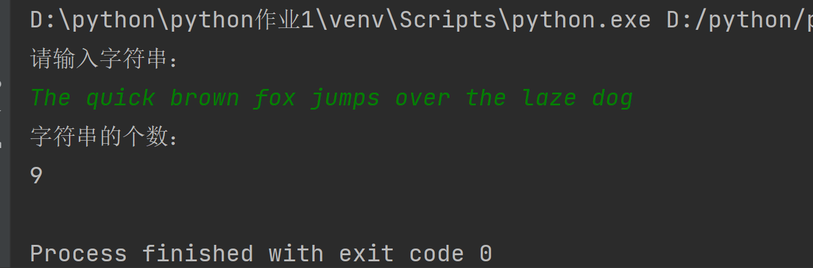
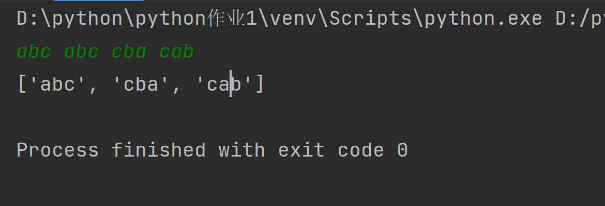
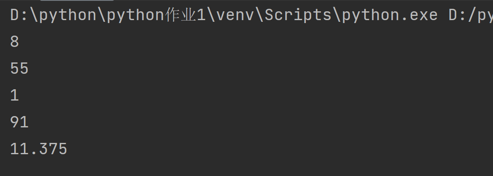
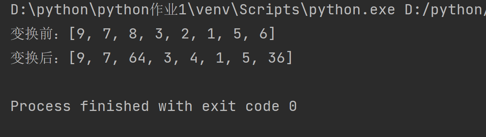
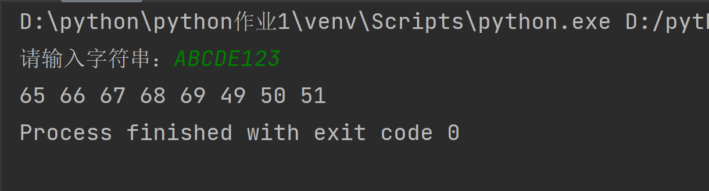

## 第二次实验
### 2.2
```python
print('请输入字符串：')
lst = list(map(str, input().split()))
print('字符串的个数：')
print(len(lst))
```


### 2.3
```python
def f(list):
    resultList = []
    for item in list:
        if not item in resultList:
            resultList.append(item)
    return resultList


lst = list(map(str, input().split()))
ans = f(lst)
print(ans)
```


### 2.4
```python
s = [9,7,8,3,2,1,55,6]
print(len(s))
print(max(s))
print(min(s))
print(sum(s))
print(sum(s)/len(s))
```



### 2.5
```python
s = [9, 7, 8, 3, 2, 1, 5, 6]
print("变换前：", end='')
print(s)
for i in range(0, len(s)):
    if s[i] % 2 == 0:
        s[i] = s[i] * s[i]
print("变换后：", end='')
print(s)
```


### 2.6
```python
s = input("请输入字符串：")
for i in range(0, len(s)):
    print(ord(s[i]), end=' ')
```



