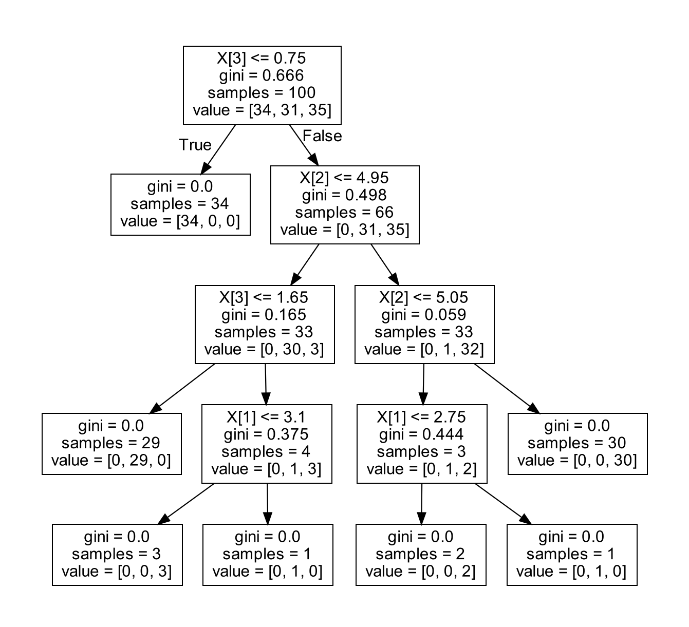
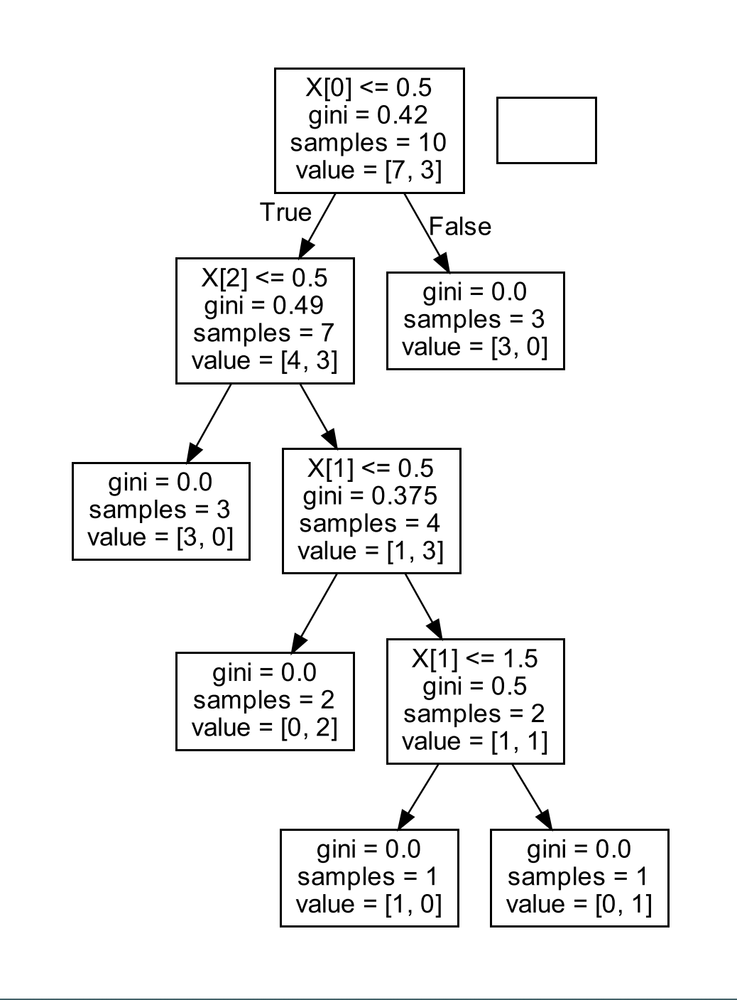

## 决策树
### 第一题
要求：
 自己创建至少2个向量，每个向量至少1个属性和1个类标号，根据向量生成决策树，并利用该决策树进行预测。

代码:
```python
from sklearn import tree
import random

X = [[42, 10], [25, 18], [33, 11], [55, 10], [16, 33],[10, 20], [15, 17], [23, 21], [50, 20], [20, 34]]
Y = [0, 1, 0, 1, 1,0, 1, 0, 0, 1]
clf = tree.DecisionTreeClassifier()
clf = clf.fit(X, Y)

demo1 = [[random.random()*100,random.random()*100],
         [random.random()*100,random.random()*100],
         [random.random()*100,random.random()*100]]

print(demo1)

print(clf.predict(demo1))
print(clf.predict_proba(demo1))  # 计算属于每个类的概率
```
运行结果:
```text
D:\python\python作业1\venv\Scripts\python.exe D:\python\python作业1\数据挖掘\作业3_鸢尾花数据\t1.py 
[[33.45909223345147, 0.7127693677026814], [75.27220227333554, 95.63012812238267], [21.18118782977114, 59.71652266905208]]
[0 1 1]
[[1. 0.]
 [0. 1.]
 [0. 1.]]

Process finished with exit code 0
```

### 第二题
要求对鸢尾花数据构建决策树，可以直接用python的sklearn包调用数据，并进行决策树分类，预测。然后用pypotplus包，进行可视化。
```python
from sklearn import tree
from sklearn.tree import DecisionTreeClassifier
from sklearn.datasets import load_iris
from sklearn.model_selection import train_test_split
from sklearn.metrics import accuracy_score
import graphviz
import os

os.environ["PATH"] += os.pathsep + 'C:/Program Files/Graphviz/bin/'

iris = load_iris()

iris = load_iris()
features = iris.data
labels = iris.target

train_features, test_features, train_labels, test_labels = train_test_split(features, labels, test_size=0.33, random_state=0)

clf = DecisionTreeClassifier()

clf = clf.fit(train_features, train_labels)

test_predict = clf.predict(test_features)

score = accuracy_score(test_labels, test_predict)
score2 = clf.score(test_features, test_labels)
print(score, score2)

dot_data = tree.export_graphviz(clf)
graph = graphviz.Source(dot_data)

graph.view()
```
运行结果:


### 第三题
要求:
不使用sklearn中的决策树方法，根据以下数据集自己编写决策树构建程序

代码:
```python
from sklearn.datasets import load_iris
import pydotplus 
from sklearn import tree

X = [
    [1, 0, 1],
    [0, 1, 1],
    [0, 0, 0],
    [1, 1, 1],
    [0, 2, 1],
    [0, 1, 0],
    [1, 2, 1],
    [0, 0, 1],
    [0, 1, 0],
    [0, 0, 1]
]

Y = [0, 0, 0, 0, 1, 0, 0, 1, 0, 1]

mode = tree.DecisionTreeClassifier()

clf = mode.fit(X, Y)

dot_data = tree.export_graphviz(clf, out_file=None)
graph = pydotplus.graph_from_dot_data(dot_data)
graph.write_pdf("fyy.pdf")
```

结果:



## 总结
这次实验主要学习了决策树,通过运用sklearn包来实现决策树的生成。并且学习了用graphviz包导出pdf，这使我对数据可视化又有了更新的认识。

本次实验遇到的问题主要是python数组操作的问题，在操作时不太熟练，很多时候数组元素没有对应，还要加强python语言的熟练度。


