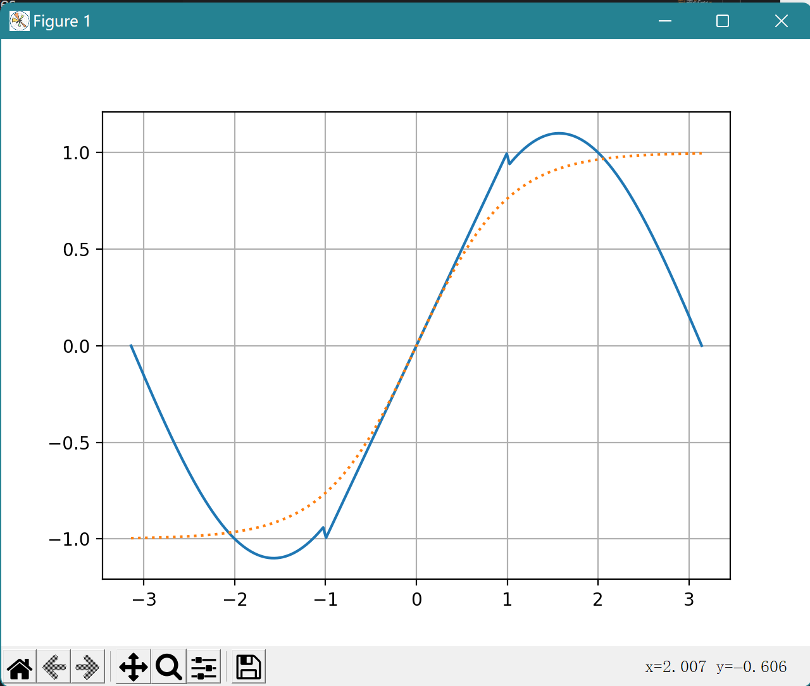
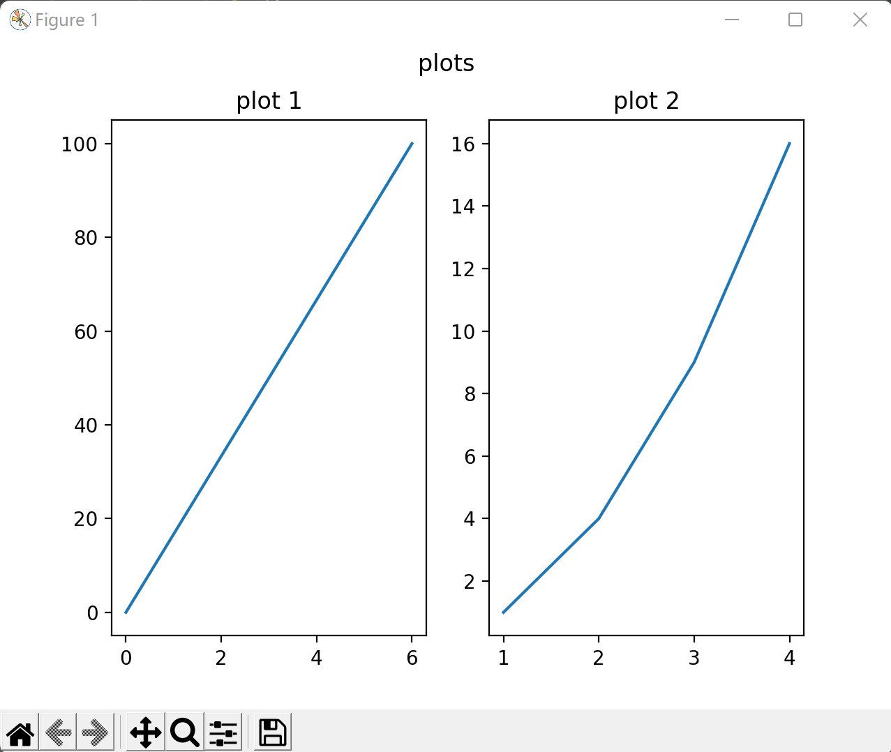
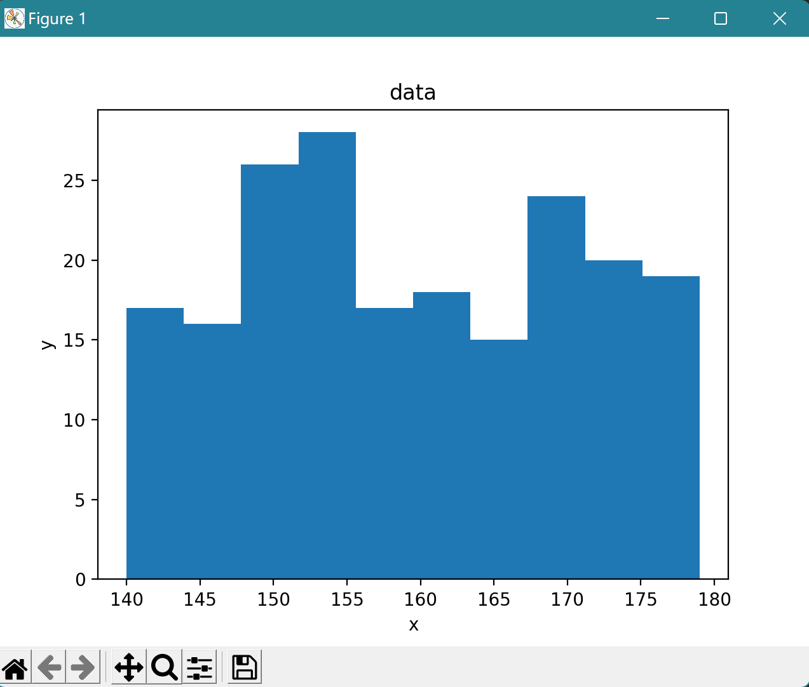
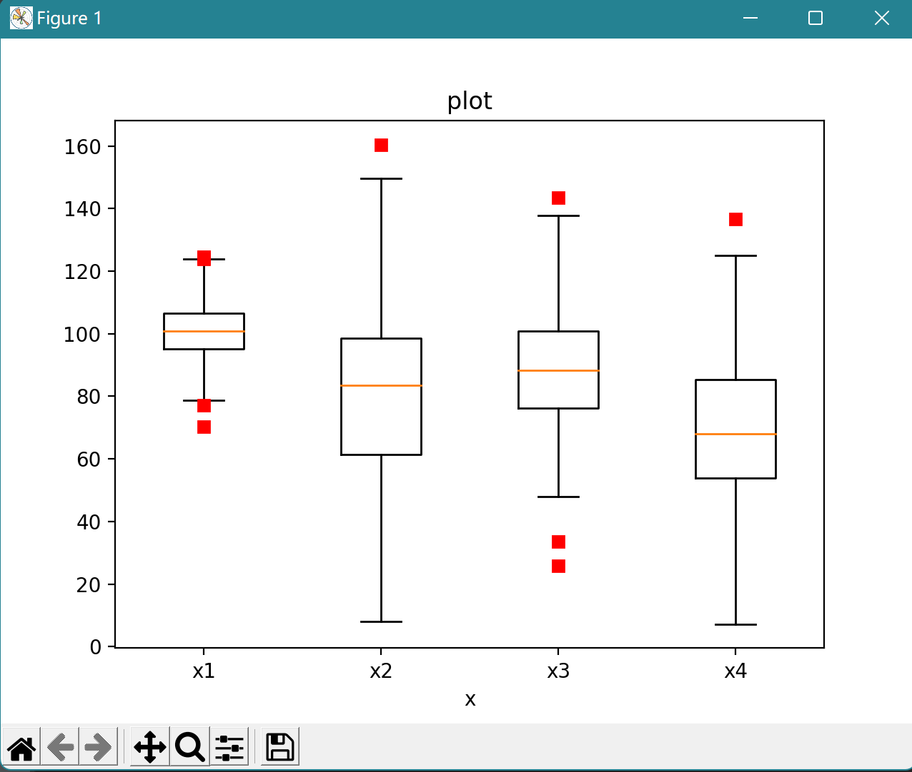
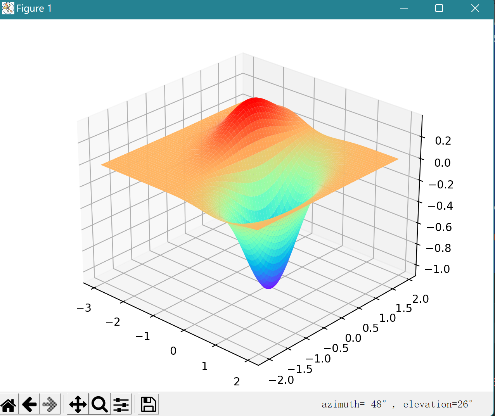
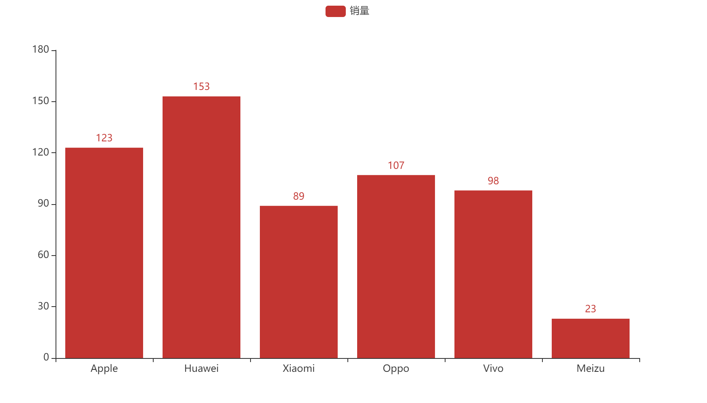

## 第二次实验
### 第一题
绘制正弦曲线
```python
import numpy as np
import matplotlib.pyplot as plt

x = np.arange(0, 2 * np.pi, 0.01)
y = np.sin(x)

plt.plot(x, y)
plt.xlabel('X')  
plt.ylabel('Y')  
plt.title("Y=Sin(X)")  
plt.show()

```
.png)
总结：很常规的正弦曲线

### 第二题
同一坐标系中绘制多种曲线并通过样式、宽度、颜色加以区分
```python
import math
import numpy as np
from matplotlib.pyplot import *

x = np.linspace(-np.pi, np.pi, 200)
interval1 = [1 if (i > 1 or i < -1) else 0 for i in x]
interval2 = [1 if (1 >= i >= -1) else 0 for i in x]
y1 = 1.1*np.sin(x)*interval1+x*interval2
y2 = (np.exp(x)-np.exp(-x))/(np.exp(x)+np.exp(-x))
plot(x, y1)
plot(x, y2, linestyle='dotted')
grid()
show()
```

总结：两个图像共用一个自变量，通过改变plot中属性值对图表进行区分

### 第三题
绘制多轴子图
```python
import matplotlib.pyplot as plt
import numpy as np

#plot 1:
x = np.array([0, 6])
y = np.array([0, 100])

plt.subplot(1, 2, 1)
plt.plot(x,y)
plt.title("plot 1")

#plot 2:
x = np.array([1, 2, 3, 4])
y = np.array([1, 4, 9, 16])

plt.subplot(1, 2, 2)
plt.plot(x,y)
plt.title("plot 2")


plt.suptitle("plots")
plt.show()
```

总结:通过subplot()命令来画子图

### 第四题
绘制直方图
```python
import numpy as np
import matplotlib.pyplot as plt

x_value = np.random.randint(140, 180, 200)

plt.hist(x_value, bins=10)

plt.title("data")
plt.xlabel("x")
plt.ylabel("y")

plt.show()
```

总结:导入matplotlib.pyplot模块, 然后准备数据，可以使用numpy/pandas整理数据,接着调用pyplot.hist()绘制直方图

### 第五题
绘制散点图
```python
import numpy as np
import matplotlib.pyplot as plt

np.random.seed(10)
collectn_1 = np.random.normal(100, 10, 200)
collectn_2 = np.random.normal(80, 30, 200)
collectn_3 = np.random.normal(90, 20, 200)
collectn_4 = np.random.normal(70, 25, 200)
data_to_plot = [collectn_1, collectn_2, collectn_3, collectn_4]

plt.boxplot(data_to_plot, notch=False, sym='rs', vert=True)
plt.xticks([y + 1 for y in range(len(data_to_plot))], ['x1', 'x2', 'x3', 'x4'])
plt.xlabel('x')
t = plt.title('plot')
plt.show()

```

总结:用plt.boxplot()函数绘制箱型图

### 第七题
用了数学建模用到的函数图
```python
from matplotlib import pyplot as plt
import numpy as np
from mpl_toolkits.mplot3d import Axes3D

figure = plt.figure()
ax = Axes3D(figure)
X = np.arange(-3, 2, 0.08)
Y = np.arange(-2, 2, 0.08)
X, Y = np.meshgrid(X, Y)
Z = (X**2-2**X)*np.exp(-X**2-Y**2-X*Y)
ax.plot_surface(X, Y, Z, rstride=1, cstride=1, cmap='rainbow')
plt.show()
```

总结:三维画图用到Axes3D包


### 第八题
```python
from pyecharts.charts import *
from pyecharts.components import Table
from pyecharts import options as opts
from pyecharts.commons.utils import JsCode
import random
import datetime

from pyecharts.globals import CurrentConfig

bar = Bar()

x_data = ['Apple', 'Huawei', 'Xiaomi', 'Oppo', 'Vivo', 'Meizu']
y_data = [123, 153, 89, 107, 98, 23]

bar.add_xaxis(x_data)
bar.add_yaxis("销量", y_data)

bar.render("./picture.html")
```

总结:给了数据之后,pyecharts可以自己生成图标

## 总结
本次实验主要学习了使用python中的
matplotlib库来进行图形绘制, 熟悉了常用命令,同时对二维和三维绘图都有所了解,收获很大。相信在本次实验之后再参加数学建模比赛，至少可视化部分可以更上一层楼。
