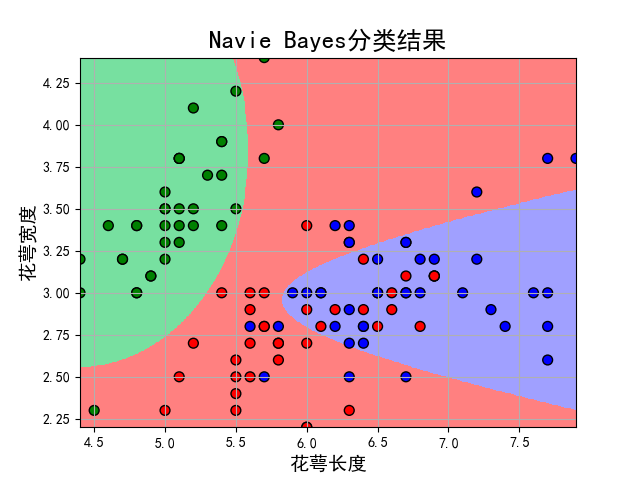

# 第四次实验
## 1. 利用KNN对鸢尾花数据进行分类。
### 分析：
第一步通过sklearn.datasets导入鸢尾花数据，然后进行KNN分类

### 代码：
```python
from sklearn.datasets import load_iris
from sklearn.metrics import accuracy_score
from sklearn.model_selection import train_test_split
from sklearn.neighbors import KNeighborsClassifier

iris = load_iris()
iris_feature = iris.data
iris_label = iris.target

x_train, x_test, y_train, y_test = train_test_split(iris_feature, iris_label, test_size=0.3, random_state=30)
knn = KNeighborsClassifier(n_neighbors=5, algorithm='auto', weights='distance', n_jobs=1)
knn.fit(x_train, y_train)
predict = knn.predict(x_test)
print(predict)
print(y_test)
print(accuracy_score(predict, y_test))
```
### 实验结果:
```
D:\python\python作业1\venv\Scripts\python.exe "C:/Program Files/JetBrains/PyCharm 2022.2.3/plugins/python/helpers/pydev/pydevconsole.py" --mode=client --host=127.0.0.1 --port=8450 
import sys; print('Python %s on %s' % (sys.version, sys.platform))
sys.path.extend(['D:\\python\\python作业1'])
PyDev console: starting.
Python 3.10.8 (tags/v3.10.8:aaaf517, Oct 11 2022, 16:50:30) [MSC v.1933 64 bit (AMD64)] on win32
>>> runfile('D:\\python\\python作业1\\数据挖掘\\作业4\\KNN（包）.py', wdir='D:\\python\\python作业1\\数据挖掘\\作业4')
[0 0 0 2 1 1 2 2 1 2 0 2 1 1 0 1 0 0 0 2 1 0 0 0 2 2 2 2 0 1 2 1 2 2 2 2 1
 2 1 2 2 2 0 1 2]
[0 0 0 2 1 1 2 2 1 2 0 2 1 1 0 1 0 0 0 1 2 0 0 0 2 2 1 2 0 1 2 1 2 2 2 2 1
 2 1 2 2 2 0 1 2]
0.9333333333333333
```

## 2.利用Navie Bayes对鸢尾花数据建模
### 分析
与第一题类似,先导入数据,之后用朴素贝叶斯算法分类
### 代码
```python

from sklearn import datasets
from sklearn.model_selection import train_test_split
from sklearn.naive_bayes import MultinomialNB, GaussianNB
import matplotlib.pyplot as plt
import numpy as np
import matplotlib as mpl
from sklearn.preprocessing import StandardScaler
from sklearn.pipeline import Pipeline

iris = datasets.load_iris() 
iris_x = iris.data  
iris_x = iris_x[:, :2]  
iris_y = iris.target    
x_train, x_test, y_train, y_test = train_test_split(iris_x, iris_y, test_size=0.75, random_state=1) 
clf = Pipeline([
        ('sc', StandardScaler()),
        ('clf', GaussianNB())])    
ir = clf.fit(x_train, y_train.ravel())  

x1_max, x1_min = max(x_test[:, 0]), min(x_test[:, 0])   
x2_max, x2_min = max(x_test[:, 1]), min(x_test[:, 1])   
t1 = np.linspace(x1_min, x1_max, 500)   
t2 = np.linspace(x2_min, x2_max, 500)
x1, x2 = np.meshgrid(t1, t2)  
x_test1 = np.stack((x1.flat, x2.flat), axis=1)
y_hat = ir.predict(x_test1) 
mpl.rcParams['font.sans-serif'] = [u'simHei']  
mpl.rcParams['axes.unicode_minus'] = False
cm_light = mpl.colors.ListedColormap(['#77E0A0', '#FF8080', '#A0A0FF']) 
cm_dark = mpl.colors.ListedColormap(['g', 'r', 'b'])   
plt.figure(facecolor='w')
plt.pcolormesh(x1, x2, y_hat.reshape(x1.shape), cmap=cm_light)  
plt.scatter(x_test[:, 0], x_test[:, 1], edgecolors='k', s=50, c=y_test, cmap=cm_dark)   
plt.xlabel(u'花萼长度', fontsize=14)
plt.ylabel(u'花萼宽度', fontsize=14)
plt.title(u'Navie Bayes分类结果', fontsize=18)
plt.grid(True)
plt.xlim(x1_min, x1_max)
plt.ylim(x2_min, x2_max)
plt.show()
y_hat1 = ir.predict(x_test)
result = y_hat1 == y_test
print(result)
acc = np.mean(result)
print('准确度: %.2f%%' % (100 * acc))
```
### 结果
```
D:\python\python作业1\venv\Scripts\python.exe "C:/Program Files/JetBrains/PyCharm 2022.2.3/plugins/python/helpers/pydev/pydevconsole.py" --mode=client --host=127.0.0.1 --port=8482 
import sys; print('Python %s on %s' % (sys.version, sys.platform))
sys.path.extend(['D:\\python\\python作业1'])
PyDev console: starting.
Python 3.10.8 (tags/v3.10.8:aaaf517, Oct 11 2022, 16:50:30) [MSC v.1933 64 bit (AMD64)] on win32
runfile('D:\\python\\python作业1\\数据挖掘\\作业4\\NavieBayes.py', wdir='D:\\python\\python作业1\\数据挖掘\\作业4')
[False  True False  True False  True  True  True  True  True  True  True
  True False False  True  True  True  True  True  True  True False  True
  True  True  True  True False False False  True  True  True False  True
  True  True False False  True  True False  True False  True False  True
  True  True  True  True False  True  True  True  True  True  True  True
  True False  True  True  True  True  True  True  True False  True  True
  True  True  True False  True  True False  True  True  True  True  True
  True  True  True  True  True  True  True  True  True False  True  True
  True False False  True False  True False  True False  True False  True
  True False False  True  True]
准确度: 74.34%
```



## 3.不使用sklearn中的分类方法，自己编写KNN程序（建议用python语言），并对鸢尾花数据进行分类。
### 分析
本题在导入数据集后, 手写KNN算法,当对测试样本进行分类时，首先通过扫描训练样本集，找到与该测试样本最相似的个训练样本，这一步通过计算欧氏距离实现。k的值取5，通过多数表决规则，把k个邻近的多数类别作为测试样本的类别
### 代码
```python
import numpy as np
from sklearn.datasets import load_iris
from sklearn.model_selection import train_test_split
import collections as co


def exp(i, j):
    return np.sqrt(np.sum(abs(i - j) ** 2))


def knn(k, predictpoint, x_train, y_train):
    dist = []
    for train_data in x_train:
        distance = exp(predictpoint, train_data)
        dist.append(distance)
    sortindex = np.argsort(dist)
    sortlabel = y_train[sortindex]
    return co.Counter(sortlabel[0:k]).most_common(1)[0][0]


if __name__ == '__main__':
    iris = load_iris()
    iris_feature = iris.data
    iris_label = iris.target
    k = 5
    x_train, x_test, y_train, y_test = train_test_split(iris_feature, iris_label, test_size=0.3, random_state=30)
    count = 0
    predict = []
    for predictpoint in x_test:
        result = knn(k, predictpoint, x_train, y_train)
        predict.append(result)
    predict = np.array(predict)
    print(predict)
    print(y_test)
    print(np.sum((predict == y_test) / y_test.size))
```

### 结果
```python
D:\python\python作业1\venv\Scripts\python.exe "C:/Program Files/JetBrains/PyCharm 2022.2.3/plugins/python/helpers/pydev/pydevconsole.py" --mode=client --host=127.0.0.1 --port=8676 
import sys; print('Python %s on %s' % (sys.version, sys.platform))
sys.path.extend(['D:\\python\\python作业1'])
PyDev console: starting.
Python 3.10.8 (tags/v3.10.8:aaaf517, Oct 11 2022, 16:50:30) [MSC v.1933 64 bit (AMD64)] on win32
>>> runfile('D:\\python\\python作业1\\数据挖掘\\作业4\\KNN手写.py', wdir='D:\\python\\python作业1\\数据挖掘\\作业4')
[0 0 0 2 1 1 2 2 1 2 0 2 1 1 0 1 0 0 0 2 1 0 0 0 2 2 2 2 0 1 2 1 2 2 2 2 1
 2 1 2 2 2 0 1 2]
[0 0 0 2 1 1 2 2 1 2 0 2 1 1 0 1 0 0 0 1 2 0 0 0 2 2 1 2 0 1 2 1 2 2 2 2 1
 2 1 2 2 2 0 1 2]
0.9333333333333336
```

## 4.不使用sklearn中的分类方法，自己编写Navie Bayes程序（建议用python语言），并对鸢尾花数据进行分类。

### 分析
收集数据, 然后通过已给定的训练集，以特征词之间独立作为前提假设，学习从输入到输出的联合概率分布，再基于学习到的模型，输入求出使得后验概率最大的输出。
### 代码
```python
from sklearn import datasets
from sklearn.model_selection import GridSearchCV, train_test_split, cross_val_score

iris = datasets.load_iris()  
data_x = iris["data"]  
data_y = iris["target"]  
num_1 = 5  


def standard_feature(feature_col, num):
    max_0 = max(data_x[:, feature_col])
    min_0 = min(data_x[:, feature_col])
    width_0 = (max_0 - min_0) / num
    for j in range(len(data_x[:, feature_col])):
        for i in range(1, num + 1):
            if min_0 + (i - 1) * width_0 <= data_x[j, feature_col] <= min_0 + i * width_0:
                data_x[j, feature_col] = i
                break


x_col_num = len(data_x[0])  


def get_pb(one_feature, col, x_train):
    '''
    one_feature在该x_train数据集的col列的概率
    :param one_feature:查找的特征是啥
    :param col: 列
    :param x_train:
    :return: 返回该特征的概率
    '''
    fea_sum = 0
    for i in x_train[:, col]:
        if i == one_feature:
            fea_sum += 1
    col_all = len(x_train)
    p_b1 = fea_sum / col_all
    return p_b1


for i in range(x_col_num): 
    standard_feature(i, num_1)
x_train, x_test, y_train, y_test = train_test_split(data_x, data_y, test_size=0.3)  
print("训练集样本数量", len(x_train))
print("测试集样本数量", len(x_test))

test_PB_list = []  #
for row_i in range(len(x_test)):
    P_B = 1
    for col_i in range(x_col_num):
        one_pb = get_pb(x_test[row_i, col_i], col_i, x_train)
        P_B *= one_pb
    test_PB_list.append(P_B)
print("test_PB_list元素个数", len(test_PB_list))
y = 3
y_index_list = []  
for y_num in range(y):
    one_y_index_list = []
    for y_index in range(len(y_train)):
        if y_train[y_index] == y_num:
            one_y_index_list.append(y_index)
    y_index_list.append(one_y_index_list)
print("训练集中每类拥有索引个数", *[len(a) for a in y_index_list])
y_num_list = []
for y_num in range(y):
    one_y_num = 0
    for y_index in range(len(y_train)):
        if y_train[y_index] == y_num:
            one_y_num += 1
    y_num_list.append(one_y_num)
print("训练集每类拥有个数", y_num_list)
test_y_predict = []  
for test_row in range(len(x_test)):  
    final_y_P = []
    for y_index in range(y):
        x_train_yindex = x_train[y_index_list[y_index], :]
        P_BinA = 1
        for col_i in range(x_col_num):
            one_pb = get_pb(x_test[test_row, col_i], col_i, x_train_yindex)
            P_BinA *= one_pb
        PAinB = (y_num_list[y_index] / len(y_train)) * P_BinA / test_PB_list[test_row]
        final_y_P.append(PAinB)
    belong_class = final_y_P.index(max(final_y_P))
    test_y_predict.append(belong_class)
print(test_y_predict)
print(list(y_test))
predict_right_num = 0
for i in range(len(test_y_predict)):
    if test_y_predict[i] == y_test[i]:
        predict_right_num += 1
probability = predict_right_num / len(test_y_predict)
print("预测正确概率", probability)
```

### 结果
```text
D:\python\python作业1\venv\Scripts\python.exe "C:/Program Files/JetBrains/PyCharm 2022.2.3/plugins/python/helpers/pydev/pydevconsole.py" --mode=client --host=127.0.0.1 --port=9003 
import sys; print('Python %s on %s' % (sys.version, sys.platform))
sys.path.extend(['D:\\python\\python作业1'])
PyDev console: starting.
Python 3.10.8 (tags/v3.10.8:aaaf517, Oct 11 2022, 16:50:30) [MSC v.1933 64 bit (AMD64)] on win32
>>> runfile('D:\\python\\python作业1\\数据挖掘\\作业4\\NavieBayes(手写).py', wdir='D:\\python\\python作业1\\数据挖掘\\作业4')
训练集样本数量 105
测试集样本数量 45
test_PB_list元素个数 45
训练集中每类拥有索引个数 38 32 35
训练集每类拥有个数 [38, 32, 35]
[1, 1, 0, 1, 2, 1, 0, 1, 1, 2, 1, 2, 1, 1, 0, 2, 2, 1, 1, 2, 1, 1, 1, 2, 2, 0, 0, 0, 0, 1, 2, 2, 1, 2, 2, 1, 0, 2, 0, 1, 0, 1, 1, 0, 0]
[1, 1, 0, 1, 2, 1, 0, 1, 1, 2, 1, 2, 1, 1, 0, 2, 2, 1, 1, 2, 1, 1, 2, 2, 2, 0, 0, 0, 0, 1, 2, 2, 1, 2, 2, 1, 0, 2, 0, 1, 0, 2, 1, 0, 0]
预测正确概率 0.9555555555555556
```

## 实验总结
本次实验，主要实现了KNN和Navie Bayes两种方式对数据集进行分类，并分别通过导包和手写实现。

总结KNN算法思路：
1. 有一个未知分类的数据A，我只知道A的特征值[x1, y1, z1], 我想知道A的分类是什么
2. 如果要通过A的特征值来判断它的分类，前提条件一定是要有一批和A相同特征且已经知道分类的样本。
3. 按KNN算法的思路，我算出A与B，C的距离，A离B近那么A的分类就是B的种类，离C近就分类成C的种类。
4. 然而，如果有很多个样本，而且我也没办法保证样本中没有异常值。 假如现在有五个样本B,C,D,E,F。其中F是异常值，而A恰好与F距离最近，如果我们就简单地选距离最近的，就容易造成错误，所以这时候就要用到KNN算法中的K了，我们选取前K个最近距离的样本，然后再选出前K个中分类数最多的那个分类。比如，K取3，然后前3个中有1个靠近F，2个不靠近E，那么我们就认为A分类是E的种类

总结Navie Bayes算法思路：
1. 朴素贝叶斯方法是一组基于Bayes定理的有监督学习算法，在给定类变量值的情况下，假设每一对特征之间的条件独立性为“朴素”假设，分解各类先验样本数据中的特征。
2. 计算各类数据中，各特征的条件概率
3. 分解待分类数据中的特征（特征1，特征2，特征3，特征4…）
4. 计算各特征的各条件概率的乘积，如下所示：

    判断为A类的概率：p(A|特征1)*p(A|特征2)*p(A|特征3)*p(A|特征4)…

    判断为B类的概率：p(B|特征1)*p(B|特征2)*p(B|特征3)*p(B|特征4)…

    判断为C类的概率：p(C|特征1)*p(C|特征2)*p(C|特征3)*p(C|特征4)…

5. 结果中的最大值就是该样本所属的类别
   