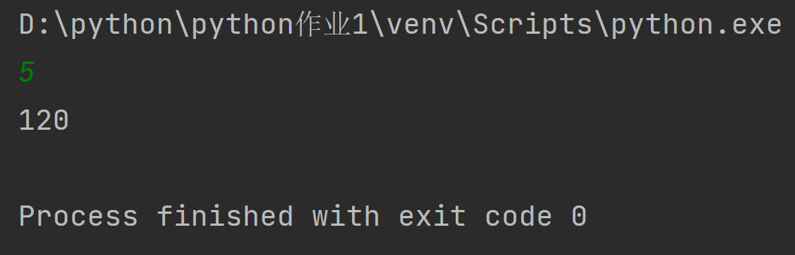
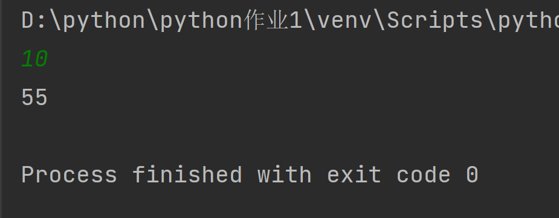
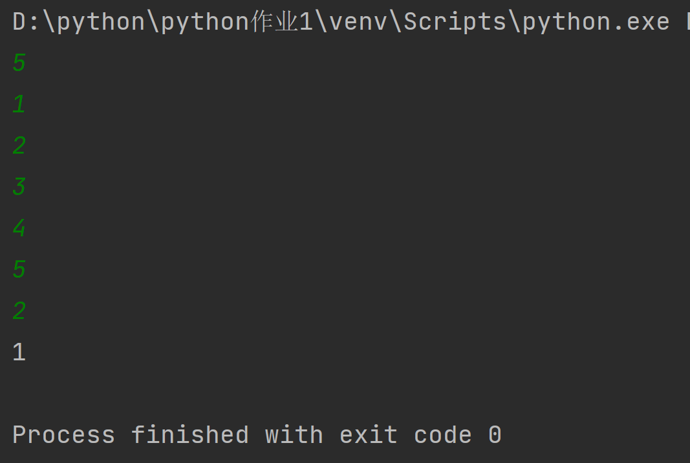
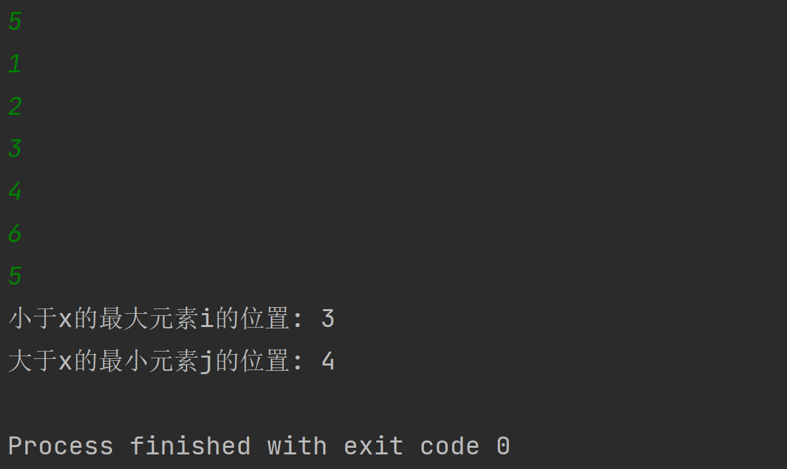

王子胤 2020414387

### 第一题
1. 分析
    - 本题可以用递归也可以迭代，考虑到本节课的内容是递归，还是用写递归，熟悉一下
    - 程序每次乘以比自己小1的数，终止条件是 n=0 或 n=1
2. 代码
    ```python
    def fun(n):
        if n == 0 or n == 1:
            return 1
        else:
            return n * fun(n - 1)

    x = int(input())
    print(fun(x))
    ```
3. 结果


### 第二题
1. 分析
   - 斐波那契数列，每一项是前两项之和，第一和第二项均为1，作为终止条件
   - 本题同样可用迭代，滚筒数组，效率较高，但是代码可读性不如递归

2. 代码
    ```python
    def fun(n):
        if n == 1 or n == 2:
            return 1
        else:
            return fun(n - 1) + fun(n - 2)


    x = int(input())
    print(fun(x))
    ```
3. 结果
   

### 第三题
1. 分析
   - 经典的二分查找,每次从中间查找,比中间值小则从数组从数组左边查找,比中间值大从右边查找,相等则返回下标
   - 如果没有找到目标,返回-1
   - 本题书本上用while循环迭代, 我就写递归试试

2. 代码
    ```python
   def fun(target, left, right, mlist):
    if left > right:
        return -1
    mid = int(left + (right - left) / 2)
    if mlist[mid] == target:
        return mid
    elif mlist[mid] > target:
        return fun(target, left, mid - 1, mlist)
    else:
        return fun(target, mid + 1, right, mlist)


    n = int(input())
    mlist = []
    for i in range(0, n):
        x = int(input())
        mlist.append(x)
    mlist.sort()
    target = int(input())
    print(fun(target, 0, n - 1, mlist))
    ```
3. 结果
    

### 第四题
1. 分析
   - 修改版的二分查找,使得当搜索元素x不在数组中时，返回小于x的最大元素位置i和大于x的最小元素位置j。只要稍微修改一下函数就可以实现
   - 当没有找到时,因为有两个需要输出的值,不好返回,因此直接在函数中输出,输出后直接结束程序,要注意此时 left 比 right大
2. 代码
    ```python
    import sys


    def fun(target, left, right, mlist):
        if left > right:
            print('小于x的最大元素i的位置:', right)
            print('大于x的最小元素j的位置:', left)
            sys.exit()
        mid = int(left + (right - left) / 2)
        if mlist[mid] == target:
            return mid
        elif mlist[mid] > target:
            return fun(target, left, mid - 1, mlist)
        else:
            return fun(target, mid + 1, right, mlist)


    n = int(input())
    mlist = []
    for i in range(0, n):
        x = int(input())
        mlist.append(x)
    mlist.sort()
    target = int(input())
    print(fun(target, 0, n - 1, mlist))

    ```
3. 结果
 

## 实验总结
- 本次实验主要使用了递归完成, 第三和第四题二分查找包含了分治法的思想
- 原来蓝桥杯参赛用的是c++, 这次尝试使用了python语言, 上手很快, 尤其在写函数时不用纠结返回值类型, 这一特点我非常喜欢
- python的input()函数之间只能按回车分隔,而不能用空格,这点挺烦人的
- 第四题没有找到目标的情况下, left > right, 因此在输出时需要反过来输出, 这点一开始没有注意, 以后编代码要更加仔细


