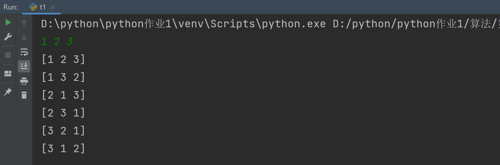
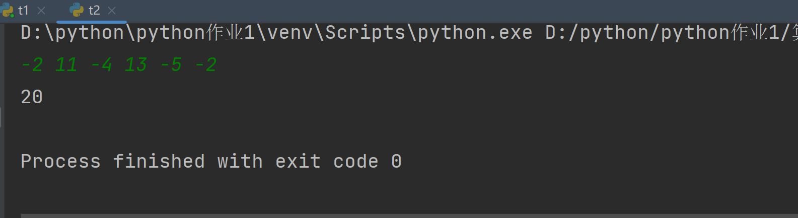
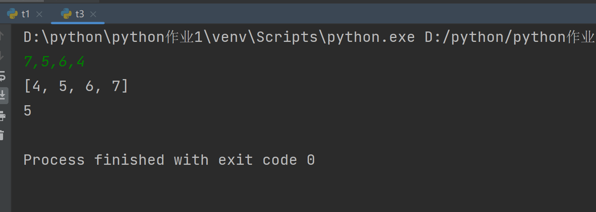
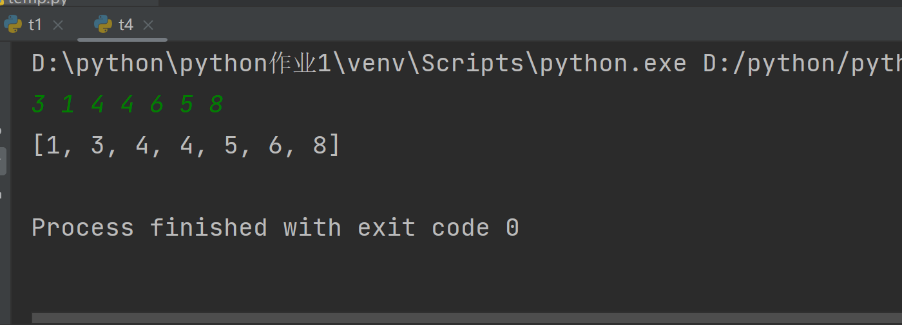

## 分治
### 1. n个整数的全排列
```python
# n个整数全排列
import numpy as np


def Perm(arr, start, size):
    if start == size:
        print(arr)
    else:
        for index in range(start, size):
            arr[index], arr[start] = arr[start], arr[index]
            Perm(arr, start + 1, size)
            arr[index], arr[start] = arr[start], arr[index]


def main():
    arr = np.array(input().split(), dtype=int)
    Perm(arr, 0, arr.size)


if __name__ == '__main__':
    main()
```

总结:
1. 算法在数组只有一个元素时结束
2. 否则返回第一个元素和之后元素的全排列(递归实现)

### 2.最大连续字段和
```python
# 最大连续字段和
import numpy as np


def fun(arr, left, right):
    ans = 0
    while right < arr.size:
        right += 1
        curs = 0
        for i in range(left, right):
            curs += arr[i]
        if curs < 0:
            left = right
        ans = max(ans, curs)
    print(ans)


def main():
    arr = np.array(input().split(), dtype=int)
    fun(arr, 0, 0)


if __name__ == '__main__':
    main()
```

总结:
1. 用的滑动窗口方法求解
2. 每次窗口右界移动一格,一旦窗口和小于0,左边界移到右边界开始,终止条件是右边界到终点

### 3.求逆序对个数
```python
# 归并排序求逆序对个数
def mergesort(lst):
    n = len(lst)
    if n < 2:
        return lst
    mid = n // 2
    left = lst[:mid]
    right = lst[mid:]

    left_sort = mergesort(left)
    right_sort = mergesort(right)

    res = merge(left_sort, right_sort)
    return res


def merge(left, right):
    global ans
    res = []
    while left and right:
        if left[0] <= right[0]:
            res.append(left.pop(0))
        else:
            res.append(right.pop(0))
            ans += len(left)
    if left:
        res.extend(left)
    if right:
        res.extend(right)

    return res


def main():
    # global ans
    lst = list(map(int, input().split(',')))
    lst = mergesort(lst)
    print(lst)
    print(ans)


if __name__ == '__main__':
    ans = 0
    main()
```

总结:
   这道题遇到了不少问题
1. 记得每个函数要有返回值,return res忘写了
2. pop()是弹出索引最大的元素！而pop(0)才是弹出数组索引最小的元素！
3. 求逆序数对，在合并时，对于每一个右边小于左边的数，此时所有左边的数都会产生一个逆序对的贡献，因此对数要加的是左边数组的长度而不是仅仅加一

### 4.非递归归并排序
```python
def merge_sort(nums):
    i = 1
    tmp = [0] * len(nums)
    while i < len(nums):
        low = 0
        while low < len(nums):
            mid = low + i
            high = min(low + 2 * i, len(nums))
            if mid < high:
                merge(nums, low, mid, high, tmp)
            low += 2 * i
        i *= 2


def merge(nums, low, mid, high, tmp):
    i = low
    j = mid
    k = low
    while i < mid and j <= high:
        if nums[i] < nums[j]:
            tmp[k] = nums[i]
            k += 1
            i += 1
        else:
            tmp[k] = nums[j]
            j += 1
            k += 1
    if i < mid:
        tmp[k:high + 1] = nums[i:mid]
    if j <= high:
        tmp[k:high + 1] = nums[j:high + 1]
    nums[low:high + 1] = tmp[low:high + 1]


def main():
    nums = [eval(x) for x in input().split()]
    merge_sort(nums)
    print(nums)


if __name__ == '__main__':
    main()
```

总结:
1. 第四题的要点是在mergeSort函数中,将递归的过程改为非递归,首先将待排序的数组中的元素两两配对,用合并算法将它们排序,构成n/2组长度为2的排好序的子数组段,然后再将它们排序成长度为4排好序的子数组段,如此继续下去,直到整个数组排好序。

### 总结
- 本次实验重点学习了用分治的思想编写程序，这次我彻底掌握了用python编写归并排序，对于二分和递归求解问题有了更深的理解。
- 第三题难度最大，求逆序对数即使在leetcode上也是难题，在合并时，对于每一个右边小于左边的数，此时所有左边的数都会产生一个逆序对的贡献，因此对数要加的是左边数组的长度而不是仅仅加一。
- 第三和第四题的不同合并排序方式的对比，让我对递归的本质和运算顺序有了更深的理解。