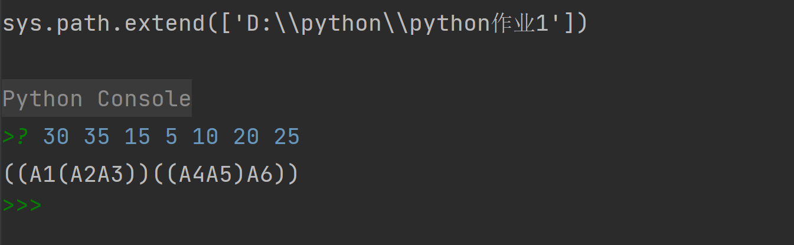
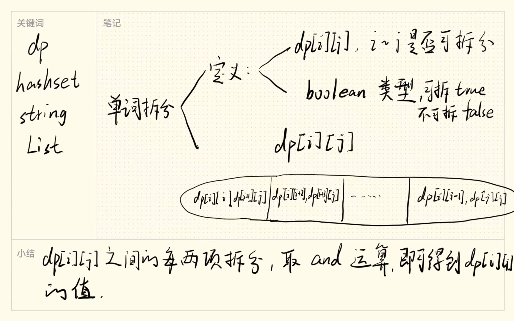
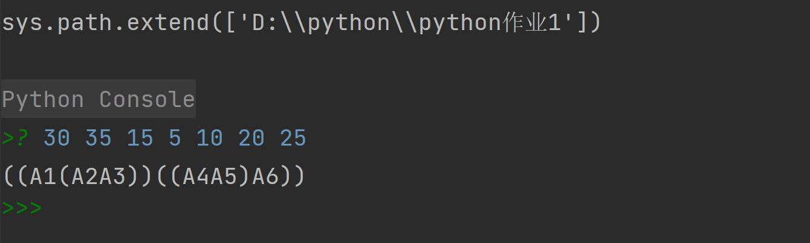
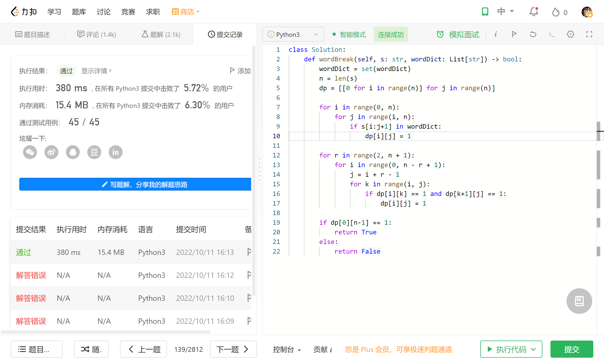

# 作业3 动态规划
## 矩阵连乘
### 问题分析
首先，若A是一个 p * q 的矩阵，B是一个q * r的矩阵，则其乘积C=AB是一个p * r 的矩阵，运算次数是 p * q * r。

然后，计算A[i:j]的最优计算次序。设这个计算次序在矩阵Ak和Ak+1之间将矩阵链断开，i<=k<j ，则其相应完全加括号方式为(AiAi+1…Ak)(Ak+1 Ak+2…Aj)计算量: A[i:k] 的计算量加上A[k+1:j]的计算量，再加上A[i:k]和A[k+ 1:j]相乘的计算量。

设计算A[i:j]，1<=i<=j<=n， 所需要的最少数乘次数m[i,j]，则原问题的最优值为m[1,n]
当i=j时，A[:j]=A 为单一-矩阵，无需计算，因此，m[i,i]=0， i-1.2…n. 当i<j时，m[i,j]=m[i,k]+m[k+1,j]+ Pi-1Pk Pj;

### 程序代码
```python
def MatrixChain(p, n, m, s):
    for r in range(2, n + 1):
        for i in range(1, n - r + 2):
            j = i + r - 1
            m[i][j] = m[i + 1][j] + p[i - 1] * p[i] * p[j]  
            s[i][j] = i  
            for k in range(i, j):  
                t = m[i][k] + m[k + 1][j] + p[i - 1] * p[k] * p[j]
                if t < m[i][j]:
                    m[i][j] = t
                    s[i][j] = k
    return m[1][n]


def Traceback(i, j, s):
    if i == j:
        print('A%d' % (i), end='')
        return  
    print("(", end='')  
    Traceback(i, s[i][j], s)
    Traceback(s[i][j] + 1, j, s)
    print(")", end='')


p = input().split()
n = len(p)
p = [int(x) for x in p]  
m = []
s = []
for i in range(n):
    m.append([])
    s.append([])
    for j in range(n):
        m[i].append(0)
        s[i].append(0)  
ans = MatrixChain(p, n - 1, m, s)
Traceback(1, n - 1, s)
print('\n最小计算量为：', ans)
```

### 运行结果



## 单词拆分
### 问题分析



### 程序代码
```python
'''
矩阵连乘问题
A1 A2 A3 A4 A5 A6...相乘，求计算量最小的加括号的方式
m[i][j] :A[i]到A[j]的计算量
s[i][j] :A[i]到A[j] 应该加括号的地方
'''


def MatrixChain(p, n, m, s):
    for r in range(2, n + 1):
        for i in range(1, n - r + 2):
            j = i + r - 1
            m[i][j] = m[i + 1][j] + p[i - 1] * p[i] * p[j]  # 计算m[i][j]
            s[i][j] = i  # 计算s[i][j]
            for k in range(i, j):  # 把计算量大的m替换掉
                t = m[i][k] + m[k + 1][j] + p[i - 1] * p[k] * p[j]
                if t < m[i][j]:
                    m[i][j] = t
                    s[i][j] = k
    return m[1][n]


def Traceback(i, j, s):
    if i == j:
        print('A%d' % (i), end='')
        return  # i==j 时输出Ai
    print("(", end='')  # 输出左括号，调用递归，输出右括号
    Traceback(i, s[i][j], s)
    Traceback(s[i][j] + 1, j, s)
    print(")", end='')


p = input().split()
n = len(p)
p = [int(x) for x in p]  # 输入A1的行数和列数以及A2,A3...的列数
m = []
s = []
for i in range(n):
    m.append([])
    s.append([])
    for j in range(n):
        m[i].append(0)
        s[i].append(0)  # 初始化m, s
ans = MatrixChain(p, n - 1, m, s)
Traceback(1, n - 1, s)
print('\n最小计算量为：', ans)
```
### 运行结果


leetcode测试



# 总结
1. 本次实验主要学习了动态规划问题的分析,以及代码求解。
2. 矩阵连乘课上讲过求解思想，程序的难点在于输出最小连乘序列，涉及到保存动态规划路劲的问题，需要额外用一个数组s[ ][ ]，来保存结果，本题时间复杂度较高，之后可以考虑如何降低复杂度。
3. 同样是动态规划问题。这题我是自己想的，但是时间复杂度达到了 O(n^3), 求解过程较为繁琐，对比 leetcode上的题解，发现题解可以简化成一维数组，dp[ i ]的定义为s 的前 i 位是否可以用wordDict中的单词表示。而我是用 dp[ i ][ j ]表示 i到j位是否可以用wordDict中的单词表示，要更复杂。
简化版代码如下：
```python
class Solution:
    def wordBreak(self, s: str, wordDict: List[str]) -> bool:       
        n=len(s)
        dp=[False]*(n+1)
        dp[0]=True
        for i in range(n):
            for j in range(i+1,n+1):
                if(dp[i] and (s[i:j] in wordDict)):
                    dp[j]=True
        return dp[-1]
```


